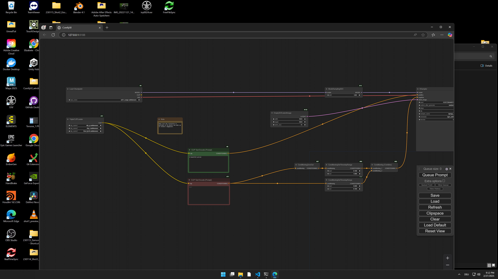
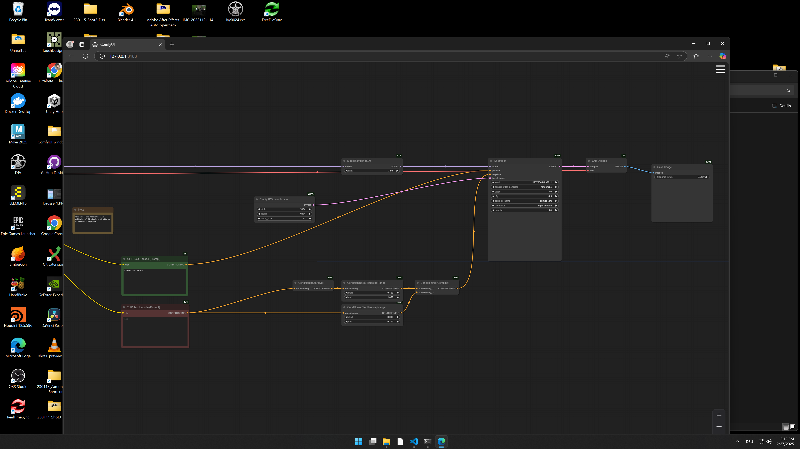

## Goal 

My goal for this project was to generate images using Stable Diffusion 3.5 to better understand the biases that remain in this version. Since the emergence of image generation models, companies like Stable Diffusion have faced criticism for the biases present in their models. With each new version, they aim to address these issues and make improvements. I wanted to examine which biases persist in one of the latest versions of Stable Diffusion, so I conducted this analysis using version 3.5. To do this, I created a set of intentionally simple prompts to observe the default images generated by Stable Diffusion.

## Setup 

### Image Generation 
I first downloaded Stable Diffusion 3.5 from Hugging Face onto one of the desktops in the CTech room. Using ComfyUI, I generated 100 images for each of five different prompts. My goal is to eventually generate 100 images for 30 prompts; however, I underestimated how long the process would take.

Below is an example of my ComfyUI setup::

 
 

To speed things up, I ran these prompts overnight at the university, setting the batch size to 10 and queuing the prompt 10 times, which took six hours to complete. I initially attempted to use a batch size of 100, but the program refused to run due to limited GPU space. I also chose not to reduce the resolution of the images, as I found that anything below 1024x1024 produced overly simplistic results that did not accurately reflect the capabilities of the latest version of Stable Diffusion.

As a result, I have attached the five prompts I was able to process so far:

- A nurse (100 images)
- A person walking down the street (100 images)
- A teacher (100 images)
- A university student (100 images)

You can find all the generated images in the corresponding files: nurse, person_walking_street, teacher, and university_student.

### Juypter and Python 

Next, I wrote a Python script and ran it in Jupyter, using a machine learning captioning model called BLIP to generate captions for each image. I then organized the data into a table using Pandas. You can find the script in the file blip_jupyter.py.

Below that, you’ll find the tables generated for each prompt, which include the image, the image name (corresponding to the file name), and the generated caption. These files are named:

- output_nurse.ipynb
- output_person_street.ipynb
- output_teacher.ipynb
- output_university_student.ipynb

### Future 

The next step is to further analyze the generated captions using Pandas to extract relevant statistics. Unfortunately, I ran out of time to complete this for the course, but I plan to include it in my Orientation Project.

### Findings
Even without using Pandas to extract statistics from the generated captions, I have already noticed some concerning biases. In the "A nurse" prompt, all the images depict women, while "A person walking down the street" is predominantly represented by men. Similarly, "A teacher" is mostly portrayed as female, and "A university student" is predominantly shown as a young man.

### Learnings 

I learned a great deal during this course. Before entering the classroom, I had never worked with Python and didn’t even know what Hugging Face was. Now, I feel that my understanding of machine learning has grown immensely. I learned how to download and run a machine learning model from Hugging Face on a desktop, how to use the BLIP model, and how to work with Python. This project also introduced me to Jupyter, which I will definitely be using in future projects. 